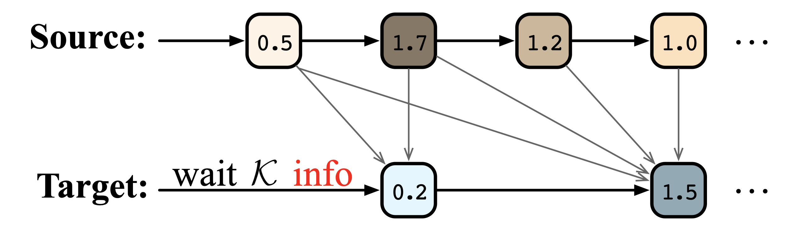

# Wait-info Policy: Balancing Source and Target at Information Level for Simultaneous Machine Translation

Source code for our EMNLP 2022 paper "[Wait-info Policy: Balancing Source and Target at Information Level for Simultaneous Machine Translation](https://arxiv.org/pdf/2210.11220.pdf)"



Our method is implemented based on the open-source toolkit [Fairseq](https://github.com/pytorch/fairseq).

## Requirements and Installation

- Python version = 3.6

- [PyTorch](http://pytorch.org/) version = 1.7

- Install fairseq:

  ```bash
  git clone https://github.com/ictnlp/Wait-info.git
  cd Wait-info
  pip install --editable ./
  ```


## Quick Start

### Data Pre-processing

We use the data of IWSLT15 English-Vietnamese (download [here](https://nlp.stanford.edu/projects/nmt/)) and WMT15 German-English (download [here](https://www.statmt.org/wmt15/)).

For WMT15 German-English, we tokenize the corpus via [mosesdecoder/scripts/tokenizer/normalize-punctuation.perl](https://github.com/moses-smt/mosesdecoder) and apply BPE with 32K merge operations via [subword_nmt/apply_bpe.py](https://github.com/rsennrich/subword-nmt). Follow [preprocess scripts](https://github.com/Vily1998/wmt16-scripts) to perform tokenization and BPE.

Then, we process the data into the fairseq format, adding `--joined-dictionary` for WMT15 German-English:

```bash
src=SOURCE_LANGUAGE
tgt=TARGET_LANGUAGE
train_data=PATH_TO_TRAIN_DATA
vaild_data=PATH_TO_VALID_DATA
test_data=PATH_TO_TEST_DATA
data=PATH_TO_DATA

# add --joined-dictionary for WMT15 German-English
fairseq-preprocess --source-lang ${src} --target-lang ${tgt} \
    --trainpref ${train_data} --validpref ${vaild_data} \
    --testpref ${test_data}\
    --destdir ${data} \
    --workers 20
```

### Training

Train the Wait-info with the following command:

```bash
export CUDA_VISIBLE_DEVICES=0,1,2,3

data=PATH_TO_DATA
modelfile=PATH_TO_SAVE_MODEL

python train.py --ddp-backend=no_c10d ${data} --arch transformer --share-all-embeddings \
 --optimizer adam \
 --adam-betas '(0.9, 0.98)' \
 --clip-norm 0.0 \
 --lr 5e-4 \
 --lr-scheduler inverse_sqrt \
 --warmup-init-lr 1e-07 \
 --warmup-updates 4000 \
 --dropout 0.3 \
 --encoder-attention-heads 8 \
 --decoder-attention-heads 8 \
 --criterion label_smoothed_cross_entropy \
 --label-smoothing 0.1 \
 --left-pad-source False \
 --save-dir ${modelfile} \
 --max-tokens 8192 --update-freq 1 \
 --fp16 \
 --save-interval-updates 1000 \
 --keep-interval-updates 500 \
 --log-interval 10
```

### Inference

Evaluate the model with the following command:

- Note that simultaneous machine translation require `--batch-size=1`with `--sim-decoding`.

```bash
export CUDA_VISIBLE_DEVICES=0
data=PATH_TO_DATA
modelfile=PATH_TO_SAVE_MODEL
ref_dir=PATH_TO_REFERENCE
testk=TEST_WAIT_K

# average last 5 checkpoints
python scripts/average_checkpoints.py --inputs ${modelfile} --num-update-checkpoints 5 --output ${modelfile}/average-model.pt 

# generate translation
python generate.py ${data} --path $modelfile/average-model.pt --batch-size 1 --beam 1 --left-pad-source False --fp16  --remove-bpe --test-wait-k ${testk} --sim-decoding > pred.out

grep ^H pred.out | cut -f1,3- | cut -c3- | sort -k1n | cut -f2- > pred.translation
multi-bleu.perl -lc ${ref_dir} < pred.translation
```

- For decoding efficiency, we also provide a parallel generating version. The results are consistent with sim-decoding.

```shell
# generate translation
python generate.py ${data} --path $modelfile/average-model.pt --batch-size 250 --beam 1 --left-pad-source False --fp16  --remove-bpe --test-wait-k ${testk} > pred.out
```

## Our Results

The numerical results on IWSLT15 English-to-Vietnamese with Transformer-Small:

|  K   |  CW  |  AP  |  AL  | DAL  | BLEU  |
| :--: | :--: | :--: | :--: | :--: | ----- |
|  1   | 1.10 | 0.67 | 3.76 | 4.33 | 28.37 |
|  2   | 1.19 | 0.69 | 4.10 | 4.71 | 28.45 |
|  3   | 1.34 | 0.71 | 4.60 | 5.28 | 28.54 |
|  4   | 1.46 | 0.74 | 5.28 | 5.97 | 28.59 |
|  5   | 1.63 | 0.77 | 6.01 | 6.71 | 28.70 |
|  6   | 1.86 | 0.80 | 6.80 | 7.51 | 28.78 |
|  7   | 2.16 | 0.82 | 7.61 | 8.33 | 28.80 |
|  8   | 2.51 | 0.84 | 8.39 | 9.11 | 28.82 |

The numerical results on WMT15 German-to-English with Transformer-Base:

|  K   |  CW  |  AP  |  AL   |  DAL  | BLEU  |
| :--: | :--: | :--: | :---: | :---: | ----- |
|  1   | 1.29 | 0.61 | 3.00  | 3.77  | 27.55 |
|  2   | 1.36 | 0.64 | 3.78  | 4.56  | 28.89 |
|  3   | 1.44 | 0.67 | 4.68  | 5.46  | 29.66 |
|  4   | 1.53 | 0.71 | 5.71  | 6.43  | 30.12 |
|  5   | 1.68 | 0.74 | 6.66  | 7.37  | 30.59 |
|  6   | 1.86 | 0.77 | 7.62  | 8.33  | 31.13 |
|  7   | 2.10 | 0.79 | 8.57  | 9.26  | 31.28 |
|  8   | 2.38 | 0.81 | 9.48  | 10.18 | 31.39 |
|  9   | 2.66 | 0.83 | 10.41 | 11.11 | 31.55 |
|  10  | 3.01 | 0.85 | 11.31 | 11.97 | 31.68 |
|  11  | 3.38 | 0.87 | 12.16 | 12.82 | 31.66 |
|  12  | 3.81 | 0.88 | 12.99 | 13.64 | 31.69 |
|  13  | 4.25 | 0.89 | 13.79 | 14.43 | 31.88 |
|  14  | 4.73 | 0.90 | 14.56 | 15.19 | 31.94 |
|  15  | 5.20 | 0.91 | 15.32 | 15.92 | 32.05 |

The numerical results on WMT15 German-to-English with Transformer-Big:

|  K   |  CW  |  AP  |  AL   |  DAL  | BLEU  |
| :--: | :--: | :--: | :---: | :---: | ----- |
|  1   | 1.30 | 0.62 | 3.41  | 4.17  | 29.19 |
|  2   | 1.37 | 0.65 | 4.19  | 4.90  | 30.42 |
|  3   | 1.46 | 0.69 | 5.12  | 5.79  | 31.26 |
|  4   | 1.56 | 0.72 | 6.05  | 6.74  | 31.68 |
|  5   | 1.71 | 0.75 | 6.96  | 7.65  | 32.04 |
|  6   | 1.88 | 0.77 | 7.94  | 8.57  | 32.32 |
|  7   | 2.14 | 0.80 | 8.83  | 9.49  | 32.56 |
|  8   | 2.40 | 0.82 | 9.75  | 10.38 | 32.86 |
|  9   | 2.68 | 0.84 | 10.66 | 11.25 | 32.99 |
|  10  | 3.00 | 0.85 | 11.53 | 12.13 | 33.10 |
|  11  | 3.38 | 0.87 | 12.35 | 12.93 | 32.99 |
|  12  | 3.79 | 0.88 | 13.15 | 13.72 | 33.10 |
|  13  | 4.21 | 0.89 | 13.94 | 14.48 | 33.23 |
|  14  | 4.67 | 0.91 | 14.69 | 15.21 | 33.23 |
|  15  | 5.15 | 0.92 | 15.42 | 15.93 | 33.31 |

## Citation

In this repository is useful for you, please cite as:

```
@inproceedings{wait-info,
    title = "Wait-info Policy: Balancing Source and Target at Information Level
for Simultaneous Machine Translation",
    author = "Zhang, Shaolei  and
      Guo, Shoutao and
      Feng, Yang",
    booktitle = "Findings of the Association for Computational Linguistics: EMNLP 2022",
    month = dec,
    year = "2022",
    address = "Online and Abu Dhabi",
    publisher = "Association for Computational Linguistics",
    url = "https://arxiv.org/pdf/2210.11220.pdf",
}
```
